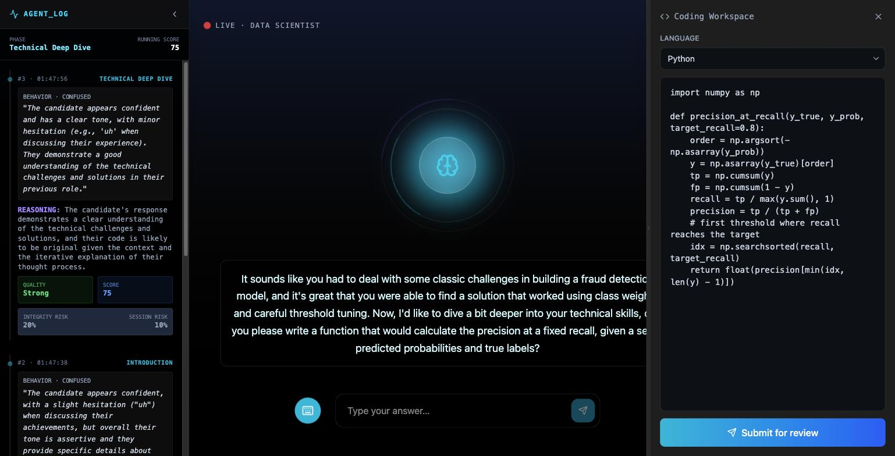
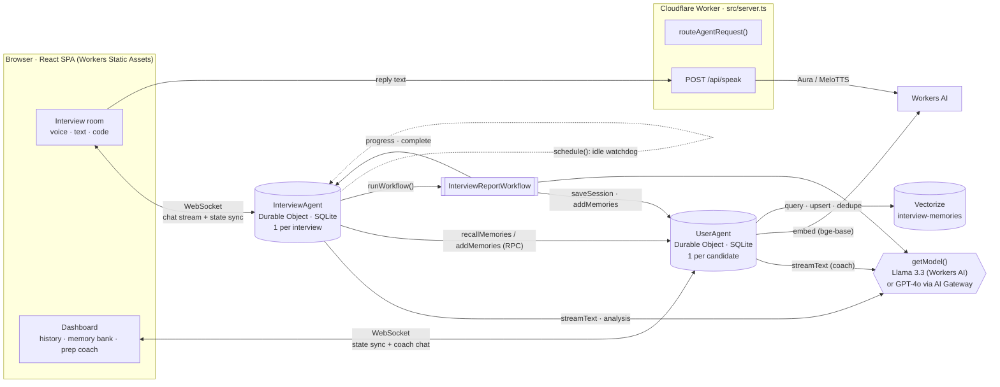
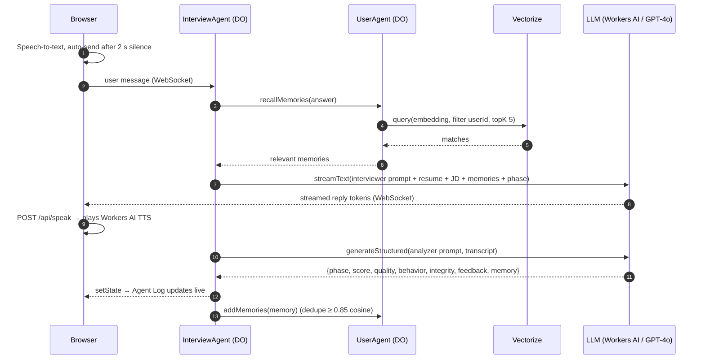
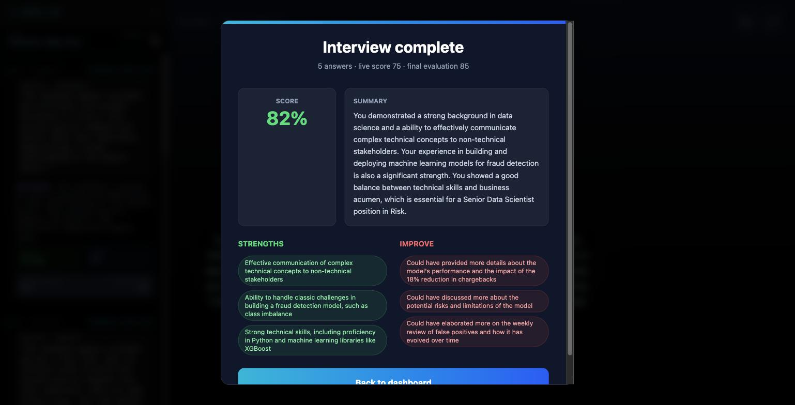
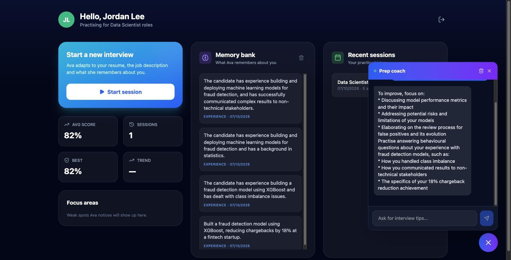

# Agentic Interview Mate

**An AI interviewer that runs realistic mock interviews by voice or chat, scores every answer while you talk, flags answers that look read or AI-generated, and remembers you between sessions. Every part runs on Cloudflare: Workers, Durable Objects (Agents SDK), Workflows, Workers AI, Vectorize and AI Gateway.**

The interviewer is called **Ava**. You paste your resume and a job description, and Ava runs a structured interview: introduction, a resume deep-dive, technical and coding questions, one behavioral (STAR) question, and a wrap-up. She adapts as she goes. She gives hints when you're stuck and pushes back on shallow answers.

After each answer, a second "silent" model call scores you and writes a live **Agent Log**. When you finish, a durable **Workflow** produces your report, combines the live scores with a final evaluation, and saves what it learned about you. The next interview, and the dashboard's prep coach, start from that memory.



---

## Contents

- [Assignment requirements → implementation](#assignment-requirements--implementation)
- [Cloudflare services used](#cloudflare-services-used)
- [AI models used](#ai-models-used)
- [Architecture](#architecture)
- [How a turn works](#how-a-turn-works)
- [How a session ends: the report workflow](#how-a-session-ends-the-report-workflow)
- [Memory and state](#memory-and-state)
- [Screenshots](#screenshots)
- [Run it locally](#run-it-locally)
- [Deploy](#deploy)
- [Configuration](#configuration)
- [Project structure](#project-structure)
- [Tech stack](#tech-stack)
- [Design decisions](#design-decisions)
- [Troubleshooting](#troubleshooting)
- [Limitations](#limitations)

---

## Assignment requirements → implementation

| Requirement                      | What this project uses                                                                                                                                                                                                                                                                                                                         | Where                                     |
| -------------------------------- | ---------------------------------------------------------------------------------------------------------------------------------------------------------------------------------------------------------------------------------------------------------------------------------------------------------------------------------------------- | ----------------------------------------- |
| **LLM**                          | **Llama 3.3 70B on Workers AI** (`@cf/meta/llama-3.3-70b-instruct-fp8-fast`), or **OpenAI GPT-4o / GPT-4o-mini** routed through **Cloudflare AI Gateway**. One variable switches between them.                                                                                                                                                 | `src/lib/llm.ts`                          |
| **Workflow / coordination**      | **Durable Objects** via the Agents SDK (`InterviewAgent` per interview, `UserAgent` per candidate), a **Cloudflare Workflow** (`InterviewReportWorkflow`) for the post-interview pipeline, and **Agent scheduling** (`this.schedule`) for the idle-timeout watchdog.                                                                           | `src/agents/*`, `src/workflows/report.ts` |
| **User input via chat or voice** | React single-page app served as **Workers Static Assets**. It talks to the agents over **WebSockets** using `useAgent` and `useAgentChat`. Input can be **voice** (browser speech-to-text, sent automatically after 2 s of silence; replies are spoken with **Workers AI text-to-speech**), **text**, or **code** from the built-in workspace. | `src/client/*`, `src/lib/speech.ts`       |
| **Memory or state**              | **Agent state** synced live to the UI. **Durable Object SQLite** holds the transcript, interview history and remembered facts. **Vectorize** holds fact embeddings for semantic recall on every turn.                                                                                                                                          | `src/agents/user.ts`, `src/lib/memory.ts` |

---

## Cloudflare services used

| Service                                          | Binding / name                                                                                   | What it does here                                                                                                                                             |
| ------------------------------------------------ | ------------------------------------------------------------------------------------------------ | ------------------------------------------------------------------------------------------------------------------------------------------------------------- |
| **Workers**                                      | `cf-ai-agentic-interview-mate` (`src/server.ts`)                                                 | The single entry point. It serves the SPA, routes `/agents/*` WebSocket and HTTP traffic to the agents, and handles `POST /api/speak`.                        |
| **Workers Static Assets**                        | `assets` → `./public` + Vite build                                                               | Hosts the React app with SPA fallback routing. This is Cloudflare's successor to Pages for full-stack apps.                                                   |
| **Agents SDK** (`agents`, `@cloudflare/ai-chat`) | `routeAgentRequest()`                                                                            | Provides the `Agent` / `AIChatAgent` base classes: state sync, `@callable` RPC, scheduling, workflow integration, and resumable chat streams over WebSockets. |
| **Durable Objects** (SQLite storage)             | `InterviewAgent`, `UserAgent`                                                                    | Each interview and each candidate is its own stateful object with its own SQLite database. Migration `v1` declares both as `new_sqlite_classes`.              |
| **Workflows**                                    | `REPORT_WORKFLOW` → `InterviewReportWorkflow` (workflow name `interview-report`)                 | Durable, multi-step report generation. Every step is checkpointed and retried independently.                                                                  |
| **Agent scheduling** (Durable Object alarms)     | `this.schedule(120, "checkInactivity")`                                                          | Ends a session after 2 idle minutes, server-side, even if the browser tab is closed.                                                                          |
| **Workers AI**                                   | `AI` (`"remote": true` in dev)                                                                   | Runs the LLM (Llama 3.3), the embeddings (bge-base) and the text-to-speech (Aura, MeloTTS).                                                                   |
| **Vectorize**                                    | `MEMORY_INDEX` → index `interview-memories` (768 dimensions, cosine, metadata index on `userId`) | Semantic search over each candidate's memories, plus near-duplicate detection.                                                                                |
| **AI Gateway** (optional)                        | `AI_GATEWAY_ID` var, resolved with `env.AI.gateway(id).getUrl("openai")`                         | Proxies LLM calls (OpenAI or Workers AI) for logging, caching, analytics and rate limiting.                                                                   |

---

## AI models used

| Purpose                                              | Default model (no API key needed)                                                      | With `OPENAI_API_KEY` set | Called from                                |
| ---------------------------------------------------- | -------------------------------------------------------------------------------------- | ------------------------- | ------------------------------------------ |
| Interviewer replies (streamed)                       | `@cf/meta/llama-3.3-70b-instruct-fp8-fast`                                             | `gpt-4o`                  | `InterviewAgent.onChatMessage`             |
| Per-turn analysis (structured JSON)                  | `@cf/meta/llama-3.3-70b-instruct-fp8-fast`                                             | `gpt-4o`                  | `InterviewAgent.analyzeTurn`               |
| Final report and memory extraction (structured JSON) | `@cf/meta/llama-3.3-70b-instruct-fp8-fast`                                             | `gpt-4o-mini`             | `InterviewReportWorkflow`                  |
| Prep-coach chat (streamed)                           | `@cf/meta/llama-3.3-70b-instruct-fp8-fast`                                             | `gpt-4o-mini`             | `UserAgent.onChatMessage`                  |
| Memory embeddings                                    | `@cf/baai/bge-base-en-v1.5` (768-dim)                                                  | same                      | `src/lib/memory.ts`                        |
| Text-to-speech                                       | `@cf/deepgram/aura-1` (voice `luna`, MP3), falling back to `@cf/myshell-ai/melotts`    | same                      | `src/lib/speech.ts`                        |
| Speech-to-text                                       | Browser Web Speech API (handled by the browser; the app's servers never receive audio) | same                      | `src/client/hooks/useSpeechRecognition.ts` |

**How the provider is chosen** (`activeProvider()` in `src/lib/llm.ts`):

- When `LLM_PROVIDER = "openai"` **and** an `OPENAI_API_KEY` is set, the OpenAI models are used. Calls go through the Chat Completions API, so AI Gateway can proxy them.
- In every other case, including a fresh clone with no secrets, the app uses **Llama 3.3 on Workers AI**.

The screenshots in this README were taken with **Llama 3.3 on Workers AI**.

All model calls go through the [Vercel AI SDK](https://ai-sdk.dev) (`ai` v6):

- `streamText` for the two chats;
- `generateText` + `Output.object(zodSchema)` for structured outputs, wrapped in `generateStructured()`, which retries empty responses.

Every prompt is documented in [PROMPTS.md](PROMPTS.md).

---

## Architecture



---

## How a turn works



**What the Agent Log shows for each answer** (`turnAnalysisSchema` in `src/lib/schemas.ts`):

- **Interview phase:** Introduction → Discovery → Technical Deep Dive → Behavioral Check → Feedback & Close.
- **Candidate behavior:** Normal, Efficient, Confused, Chatty or Adversarial, plus a free-text behavior log.
- **Answer quality:** Strong, Adequate, Weak, Irrelevant or AI-Suspected.
- **Running score (0–100):** re-evaluated over the whole conversation, not accumulated.
- **Integrity risk:** one score for this answer and one for the session. They estimate how likely the answer was read, pasted or AI-generated.
- **Coaching note:** a private one-liner shown briefly under the reply.
- **Optional memory:** a fact about the candidate worth remembering.

The interviewer's phase comes from this analysis and feeds the next turn's prompt. When Ava asks for code in a technical role ("write a function…"), the coding workspace opens automatically, and the submitted code is reviewed as an answer.

---

## How a session ends: the report workflow

A session ends in one of two ways:

- the candidate clicks **End interview**;
- the agent's **scheduled watchdog** sees 2 minutes without activity. The browser refreshes the timer while you speak, type or listen, and it also works with the tab closed.

`InterviewAgent.endSession()` then calls `this.runWorkflow("REPORT_WORKFLOW", …)`:

| #   | Step               | Details                                                                                                                                                                                                                                                                                    |
| --- | ------------------ | ------------------------------------------------------------------------------------------------------------------------------------------------------------------------------------------------------------------------------------------------------------------------------------------ |
| 1   | `score-transcript` | LLM final evaluation of the full transcript: score, 2–3 strengths, 2–3 improvements, and a summary. Up to 3 retries with exponential backoff and a 2-minute timeout.                                                                                                                       |
| 2   | `blend-scores`     | **Final score = 0.7 × final evaluation + 0.3 × average live score** (the greeting is excluded). Rubric caps are enforced in code: fewer than 3 answers caps the score at 20, and fewer than 5 at 39. If integrity risk is above 70 %, the score is capped at 50 and the report is flagged. |
| 3   | `extract-memories` | LLM extracts up to 5 durable facts, skipping facts already known.                                                                                                                                                                                                                          |
| 4   | `save-memories`    | `UserAgent.addMemories()`: SQLite insert, embedding, Vectorize upsert, and semantic dedupe.                                                                                                                                                                                                |
| 5   | `save-session`     | `UserAgent.saveSession()` writes the interview to the history table.                                                                                                                                                                                                                       |

Progress messages stream back to the agent (`onWorkflowProgress`), and the browser shows them live ("Scoring the full interview…"). The result arrives through `onWorkflowComplete`, and the report modal opens. The dashboard is subscribed to the `UserAgent`'s state, so the new session and memories appear there right away.



---

## Memory and state

**`InterviewAgent`**: one Durable Object per interview, named by a session UUID.

- **Chat transcript:** stored in the agent's SQLite by `AIChatAgent` (up to 200 messages). Reloading the page restores it.
- **Synced state** (`InterviewState` in `src/lib/types.ts`):
  - `status`: `setup` → `active` → `ending` → `complete`;
  - `config`: role, resume, job description and candidate;
  - `phase`;
  - `turns[]`: every analysis;
  - `analyzing`;
  - `lastActivityAt`;
  - `reportProgress`;
  - the final `report`.

**`UserAgent`**: one Durable Object per candidate, named by the persona id.

```sql
CREATE TABLE sessions (
  id TEXT PRIMARY KEY, role TEXT, score INTEGER, summary TEXT,
  strengths TEXT, weaknesses TEXT,           -- JSON arrays
  integrity_risk INTEGER, turn_count INTEGER, created_at INTEGER
);
CREATE TABLE memories (
  id TEXT PRIMARY KEY, text TEXT,
  type TEXT,                                 -- skill | experience | preference | weakness | fact
  session_id TEXT, created_at INTEGER
);
```

- **Synced state:** profile, the 20 most recent sessions and the 50 most recent memories, which the dashboard renders.
- **Vectorize:** one vector per memory. The vector id equals the memory id, with metadata `{ userId, type }`. Recall is scoped to `userId`.
- **Recall fallback:** if Vectorize is unavailable, recall uses the most recent memories from SQLite.
- **Clearing:** "Forget all memories" on the dashboard deletes both the SQLite rows and the vectors.

---

## Screenshots

| Interview room                                         | Report                                 | Dashboard                                    |
| ------------------------------------------------------ | -------------------------------------- | -------------------------------------------- |
|  |  |  |

The dashboard shows the stats, the memory bank (facts Ava extracted during the interview) and the prep coach, whose answer draws on the session that was just reviewed.

---

## Run it locally

**Prerequisites:** Node.js 20+ and a free Cloudflare account. Workers AI and Vectorize have no local simulator, so `npm run dev` uses them remotely and needs you to be logged in. Everything else runs locally: the Worker, the Durable Objects and the Workflow.

```bash
git clone https://github.com/PratimeshTiwari/cf_ai_agentic_interview_mate.git
cd cf_ai_agentic_interview_mate
npm install

npx wrangler login            # one-time browser login
npm run setup:vectorize       # creates index "interview-memories" (768-d, cosine) + userId metadata index

cp .dev.vars.example .dev.vars
# Optional: put OPENAI_API_KEY=sk-... in .dev.vars to use GPT-4o.
# Leave it empty to run fully on Workers AI (Llama 3.3).

npm run dev                   # http://localhost:5173
```

Then:

1. **Pick a demo persona.** Each persona has its own `UserAgent`, so its own history and memory.
2. Click **Start a new interview**, paste a resume and a job description (both optional), and press **Start interview**.
3. Answer with the **mic** (Chrome or Edge recommended for speech recognition) or the **keyboard**. Ask for code with a technical role to see the coding workspace.
4. Click **End interview** to watch the workflow produce your report, then open the **dashboard** for your history, memory bank and **prep coach**.

Useful commands:

```bash
npm run check                                      # format check + lint + type-check
npx wrangler workflows instances list interview-report   # inspect report runs (after deploy)
npx wrangler vectorize info interview-memories     # index stats
```

## Deploy

```bash
npx wrangler secret put OPENAI_API_KEY   # optional: only needed for GPT-4o
npm run deploy                           # vite build && wrangler deploy
```

The first deploy creates the Durable Object classes from migration `v1` and registers the `interview-report` workflow. The Vectorize index must already exist (see `npm run setup:vectorize`).

---

## Configuration

| Name                          | Where                               | Default              | Purpose                                                                                                    |
| ----------------------------- | ----------------------------------- | -------------------- | ---------------------------------------------------------------------------------------------------------- |
| `LLM_PROVIDER`                | `wrangler.jsonc` → `vars`           | `"openai"`           | `"openai"` (GPT-4o family) or `"workers-ai"` (Llama 3.3). Without a key, the app falls back to Workers AI. |
| `OPENAI_API_KEY`              | `.dev.vars` / `wrangler secret put` | none                 | Needed only for the OpenAI provider.                                                                       |
| `AI_GATEWAY_ID`               | `wrangler.jsonc` → `vars`           | `""`                 | The name of an AI Gateway in your account. When set, every LLM call goes through it.                       |
| `AI`                          | Workers AI binding                  | none                 | LLM, embeddings and TTS.                                                                                   |
| `MEMORY_INDEX`                | Vectorize binding                   | `interview-memories` | Memory embeddings.                                                                                         |
| `InterviewAgent`, `UserAgent` | Durable Object bindings             | none                 | The two agents.                                                                                            |
| `REPORT_WORKFLOW`             | Workflow binding                    | `interview-report`   | The report pipeline.                                                                                       |

Tunables in code:

- `INACTIVITY_LIMIT_SECONDS = 120` in `src/agents/interview.ts`
- `NEAR_DUPLICATE = 0.85` in `src/agents/user.ts`
- the score-blend weights and caps in `src/workflows/report.ts`

---

## Project structure

```
src/
  server.ts                    Worker entry: /api/speak, agent routing, static assets
  agents/
    interview.ts               InterviewAgent: streaming chat, turn analysis, idle watchdog, endSession, workflow callbacks
    user.ts                    UserAgent: SQLite history + memories, Vectorize recall/dedupe, prep-coach chat
  workflows/
    report.ts                  InterviewReportWorkflow: score → blend → extract memories → save memories → save session
  lib/
    llm.ts                     getModel(), generateStructured(), Workers AI stream fix
    prompts.ts                 All system prompts (documented in PROMPTS.md)
    schemas.ts                 Zod schemas for structured outputs
    memory.ts                  Embeddings + memory formatting
    speech.ts                  /api/speak: Workers AI TTS with fallback
    transcript.ts, types.ts    Helpers and types shared by server and client
  client/
    main.tsx                   Router: /login, /dashboard, /interview/:sessionId
    pages/                     Login, Dashboard, Interview
    components/                AIOrb, AgentLog, CodeWorkspace, ReportModal, CoachChat, UserVideo
    hooks/                     useSpeechRecognition, useSpeaker, useLastDefined
docs/screenshots/              Images used in this README
PROMPTS.md                     Every prompt used by the app (and during development)
wrangler.jsonc                 Bindings, migrations, workflow, vars
```

## Tech stack

| Layer              | Packages                                                                                             |
| ------------------ | ---------------------------------------------------------------------------------------------------- |
| Agents and runtime | `agents` 0.17, `@cloudflare/ai-chat` 0.9, Workers (`compatibility_date` 2026-06-11, `nodejs_compat`) |
| AI                 | `ai` 6 (Vercel AI SDK), `workers-ai-provider` 3.3, `@ai-sdk/openai` 3, `zod` 4                       |
| Frontend           | React 19, React Router 7, Tailwind CSS 4, Framer Motion, lucide-react                                |
| Tooling            | Vite 8 + `@cloudflare/vite-plugin`, Wrangler 4, TypeScript, oxlint, oxfmt                            |

---

## Design decisions

- **Two LLM calls per turn.** The spoken reply is streamed with `streamText`, so it starts appearing as soon as the first tokens arrive. The evaluation is a separate structured call with a strict zod schema. Mixing the two would mean either no streaming or fragile JSON parsing. The split behaves the same on Llama 3.3 and GPT-4o.
- **Agents as the unit of state.** Each interview and each candidate is its own Durable Object, so there is no external database. State syncs to the UI over the same WebSocket, and a reload never loses context.
- **A Workflow for anything that must not be lost.** Report generation spans several LLM calls and writes. Workflows checkpoint each step, so a transient failure retries just that step and never drops a report.
- **The server owns the idle timeout.** The timeout is a Durable Object schedule, not a browser `setTimeout`, so abandoned interviews still get scored and saved.
- **Code enforces the rubric.** The score caps, the integrity penalty and the score blending happen in the workflow, not in the prompt.
- **Graceful degradation:**
  - no OpenAI key: the app runs on Workers AI;
  - Vectorize unavailable: recall uses recent SQLite memories;
  - server TTS fails: MeloTTS, then browser speech;
  - an empty structured response: retried up to 3 times.

## Troubleshooting

| Symptom                                                              | Fix                                                                                                                                                                         |
| -------------------------------------------------------------------- | --------------------------------------------------------------------------------------------------------------------------------------------------------------------------- |
| `npm run dev` fails with _"necessary to set a CLOUDFLARE_API_TOKEN"_ | Run `npx wrangler login` first. Remote bindings (Workers AI, Vectorize) need auth.                                                                                          |
| Memory recall always returns recent items                            | Run `npm run setup:vectorize`. The `userId` metadata index must exist before vectors are inserted.                                                                          |
| Mic button does nothing                                              | Use Chrome or Edge and allow microphone access, or switch to keyboard input.                                                                                                |
| Streamed replies show every word twice                               | This is fixed in `src/lib/llm.ts`. Llama 3.3 on Workers AI sends each token in both `choices[].delta.content` and `response`, so the binding is wrapped to keep one source. |

## Limitations

- **Demo sign-in only.** The login screen is a persona picker stored in `localStorage`; there is no authentication. Each persona maps to its own `UserAgent`.
- **Browser speech recognition.** It relies on the Web Speech API (best in Chrome or Edge). Other browsers can still type answers.
- **The integrity score is a heuristic.** It is an LLM estimate of whether answers were read or assisted, not proof of cheating.

## License

MIT. The project was scaffolded from Cloudflare's [`agents-starter`](https://github.com/cloudflare/agents-starter) template.
