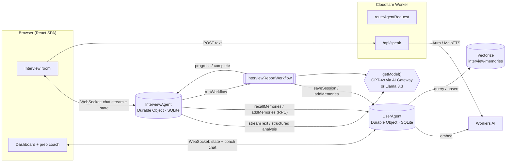

# Agentic Interview Mate

**An AI interviewer agent that runs realistic mock interviews by voice or chat, scores every answer live, flags answers that look AI-assisted, and remembers you between sessions. Built entirely on Cloudflare.**

Meet **Ava**. She reads your resume and the job description, works through a structured interview (intro, resume deep-dive, technical and coding questions, a behavioral STAR question, wrap-up), and adapts as she goes: she gives hints when you're stuck and pushes back when an answer is shallow. After every answer a second "silent" model call scores you, logs your behavior, and estimates how likely the answer was read or AI-generated. When you finish, a durable workflow writes your report, blends the live scores with a final evaluation, and saves what it learned about you so the next interview picks up where this one left off.

---

## How it meets the brief

| Requirement                   | Implementation                                                                                                                                                                                                                                                                                                                                                                      |
| ----------------------------- | ----------------------------------------------------------------------------------------------------------------------------------------------------------------------------------------------------------------------------------------------------------------------------------------------------------------------------------------------------------------------------------- |
| **LLM**                       | **GPT-4o** via `@ai-sdk/openai`, optionally routed through **Cloudflare AI Gateway**. Switch to **Llama 3.3 70B on Workers AI** (`@cf/meta/llama-3.3-70b-instruct-fp8-fast`) with one variable; it is also the automatic fallback when no OpenAI key is set. Workers AI also provides embeddings (`bge-base-en-v1.5`) and text-to-speech (Deepgram Aura, with MeloTTS as fallback). |
| **Workflow / coordination**   | Two **Durable Object agents** (Agents SDK): `InterviewAgent` (one per interview) and `UserAgent` (one per candidate). A **Cloudflare Workflow** (`InterviewReportWorkflow`) produces the report in checkpointed, retried steps, and a **scheduled task** on the agent ends idle sessions.                                                                                           |
| **User input (chat + voice)** | A React SPA served as **Worker static assets**, connected to the agents over **WebSockets** (`useAgent`, `useAgentChat`). It takes voice answers through browser speech recognition (auto-submits on silence), typed answers, and code from the built-in coding workspace.                                                                                                          |
| **Memory / state**            | Agent state syncs live to every client. The transcript is stored in the agent's **SQLite**. Long-term memory lives in the `UserAgent`: SQLite tables for history and facts, plus a **Vectorize** index for semantic recall on every turn.                                                                                                                                           |

---

## Architecture



### One interview turn

1. The candidate speaks. Browser speech recognition transcribes the answer and auto-submits it after 2 s of silence. Typed answers and code submissions take the same path.
2. `InterviewAgent.onChatMessage` asks the `UserAgent` for the memories most relevant to the answer (Vectorize semantic search, scoped to this user). It renders them into the interviewer prompt along with the role, resume, job description and current phase, then **streams** Ava's reply back over the WebSocket.
3. The browser speaks the reply with Workers AI TTS.
4. `onChatResponse` then runs a **second, structured call** (zod schema) that returns the phase, answer quality, running score, a behavior log, integrity risk, a private coaching note, and any fact worth remembering. The call writes these into agent state, so the **Agent Log** panel updates live. New facts are stored in memory immediately.

### Ending an interview

The session ends when the candidate clicks **End interview**, or when the agent's scheduled watchdog sees 2 idle minutes. This works even if the tab is closed. `InterviewAgent.endSession()` then starts `InterviewReportWorkflow`:

| Step               | What it does                                                                                                                                                                                                         |
| ------------------ | -------------------------------------------------------------------------------------------------------------------------------------------------------------------------------------------------------------------- |
| `score-transcript` | Final LLM evaluation of the full transcript (score, strengths, weaknesses, summary).                                                                                                                                 |
| `blend-scores`     | Final score = 70 % final evaluation + 30 % average live score. Rubric caps are enforced in code (fewer than 3 answers: at most 20; fewer than 5: at most 39), and an integrity risk above 70 % caps the score at 50. |
| `extract-memories` | Extracts up to 5 durable facts about the candidate, skipping ones already known.                                                                                                                                     |
| `save-memories`    | Stores them in SQLite and indexes them in Vectorize.                                                                                                                                                                 |
| `save-session`     | Writes the session to the candidate's history.                                                                                                                                                                       |

Each step is checkpointed and retried with exponential backoff. Progress messages stream back to the agent (`onWorkflowProgress`), and the final report appears through `onWorkflowComplete`. Because the dashboard is subscribed to the `UserAgent`'s state, the new session and memories show up there without a refresh.

---

## Features

- 🎙️ **Hands-free voice interviews**: speech-to-text in the browser and natural TTS from Workers AI, with keyboard input as an alternative.
- 🧠 **Adaptive interviewer**: a phased interview, harder questions after strong answers and hints after weak ones, guardrails for off-topic or prompt-injection attempts.
- 📊 **Live agent log**: per-answer score, quality, behavior analysis, reasoning, and turn-level and session-level integrity risk.
- 🛡️ **Integrity signal**: flags textbook-perfect, read-aloud or pasted answers and code. The flag feeds into the final score.
- 💻 **Coding workspace**: opens automatically when Ava asks for code (technical roles); the submission is reviewed as an answer.
- 🗂️ **Durable reports**: a Workflow that survives failures and reports progress in real time.
- 🧬 **Long-term memory**: facts are extracted per turn and per session, semantically recalled in later interviews, viewable and clearable on the dashboard.
- 💬 **Prep coach**: a streaming dashboard chat grounded in your recent sessions and memory bank.
- 🔁 **Resumable**: reload in the middle of an interview and the transcript, phase and analysis are restored from the Durable Object.

---

## Run it locally

**Prerequisites:** Node.js 20+ and a Cloudflare account (the free plan works). Workers AI and Vectorize have no local simulator, so `npm run dev` connects to them remotely and needs you to be logged in.

```bash
git clone https://github.com/PratimeshTiwari/cf_ai_agentic_interview_mate.git
cd cf_ai_agentic_interview_mate
npm install

npx wrangler login            # authenticate once
npm run setup:vectorize       # creates the 768-dim index + userId metadata index

cp .dev.vars.example .dev.vars
# Optional: add OPENAI_API_KEY=sk-... to use GPT-4o.
# Leave it empty to run fully on Workers AI (Llama 3.3).

npm run dev                   # http://localhost:5173
```

Then:

1. Pick a demo persona.
2. Click **Start a new interview**, paste a resume and a job description (optional), and press **Start interview**.
3. Answer with the mic (Chrome or Edge recommended for speech recognition) or the keyboard.
4. Click **End interview** to watch the report workflow run, then return to the dashboard to see your history, memories and the prep coach.

## Deploy

```bash
npx wrangler secret put OPENAI_API_KEY   # optional, only for GPT-4o
npm run deploy                           # vite build && wrangler deploy
```

## Configuration

| Name             | Where                           | Default              | Purpose                                                                                                                              |
| ---------------- | ------------------------------- | -------------------- | ------------------------------------------------------------------------------------------------------------------------------------ |
| `LLM_PROVIDER`   | `wrangler.jsonc` vars           | `openai`             | `openai` (GPT-4o) or `workers-ai` (Llama 3.3). Falls back to Workers AI if no key is set.                                            |
| `OPENAI_API_KEY` | `.dev.vars` / `wrangler secret` | none                 | Needed only for the OpenAI provider.                                                                                                 |
| `AI_GATEWAY_ID`  | `wrangler.jsonc` vars           | `""`                 | Name of an AI Gateway in your account. When set, all LLM calls are routed through it, which gives you logs, caching and rate limits. |
| `MEMORY_INDEX`   | Vectorize binding               | `interview-memories` | Created by `npm run setup:vectorize`.                                                                                                |

---

## Project structure

```
src/
  server.ts                 Worker entry: /api/speak, agent routing, static assets
  agents/
    interview.ts            InterviewAgent: chat, turn analysis, watchdog, endSession
    user.ts                 UserAgent: SQLite history + memories, Vectorize recall, prep coach
  workflows/
    report.ts               InterviewReportWorkflow: score → blend → memories → save
  lib/
    llm.ts                  getModel(): GPT-4o via AI Gateway | Llama 3.3 on Workers AI
    prompts.ts              All system prompts (see PROMPTS.md)
    schemas.ts              Zod schemas for structured outputs
    memory.ts, speech.ts    Embeddings, TTS
    transcript.ts, types.ts Shared helpers and types (server + client)
  client/
    pages/                  Login, Dashboard, Interview
    components/             AIOrb, AgentLog, CodeWorkspace, ReportModal, CoachChat, UserVideo
    hooks/                  useSpeechRecognition, useSpeaker
```

## Design notes

- **Two calls per turn, on purpose.** Streaming the spoken reply separately from the structured analysis keeps responses fast and lets the analysis use a strict schema. This works reliably on both GPT-4o and Llama 3.3.
- **Agents as the unit of state.** Each interview and each candidate is its own Durable Object, so there's no external database. State syncs to the UI for free, and a reload never loses context.
- **Code enforces the rubric.** Score caps and the integrity penalty are applied in the workflow rather than left to the model.
- **Graceful degradation.** Without Vectorize, recall falls back to the most recent memories. Without an OpenAI key, the app runs on Workers AI. Without server TTS, the browser speaks.

## Limitations

- The sign-in is a **demo persona picker** stored in localStorage; there is no real authentication. Each persona maps to its own `UserAgent`.
- Speech recognition depends on the browser's Web Speech API (best in Chrome or Edge). Other browsers fall back to typing.
- The integrity score is a heuristic estimate from the LLM, not proof of cheating.

## License

MIT. Scaffolded from Cloudflare's [`agents-starter`](https://github.com/cloudflare/agents-starter) template.
